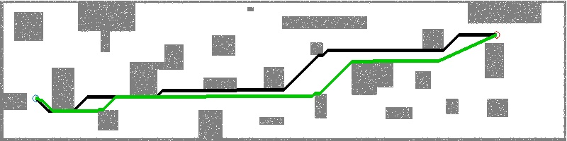

# MRSL Jump Point Search Planning Library
Implementation of Jump Point Search with [YagSBPL](https://www.math.upenn.edu/~subhrabh/html_cache/7f068a4d19ed85a15c9e25ecae8b40c1.html). Original jump point seach algorithm is proposed in ["D. Harabor and A. Grastien. Online Graph Pruning for Pathfinding on Grid Maps. In National Conference on Artificial Intelligence (AAAI), 2011"](https://www.aaai.org/ocs/index.php/AAAI/AAAI11/paper/download/3761/4007). The 3D version is proposed in "S. Liu, M. Watterson, K. Mohta, K. Sun, S. Bhattacharya, C.J. Taylor and V. Kumar. Planning Dynamically Feasible Trajectories for Quadrotors using Safe Flight Corridors in 3-D Complex Environments. ICRA 2017".

## Compilation
Required: 
 - Boost
 - Eigen
 - yaml-cpp (Reading data files)
 - VTK (For visualizing output)

A) Simple cmake
```sh
$ mkdir build && cd build && cmake .. && make
```

B) Using CATKIN
```sh
$ cd mv jps3d ~/catkin_ws/src
$ cd ~/catkin_ws & catkin_make -DCMAKE_BUILD_TYPE=Release
```

## Example Usage
The simple API are provided in the base planner class, here are three important functions to set up a planning thread:
```c++
std::unique_ptr<PlannerBase> planner(new XXXUtil(false)); // Declare a XXX planner
planner->setMapUtil(MAP_UTIL_PTR); // Set collision checking function
bool valid = planner->plan(start, goal); // Plan from start to goal
```
In this library, we consider 3D voxel grid but user can write their own 2D map util plugin using the ```MapBaseUtil``` class. Three planners are provided as follows:
 - ```AStarUtil```
 - ```JPS2DUtil```
 - ```JPS3DUtil```

The results from ```AStarUtil``` and ```JPS2DUtil``` are plotted in [corridor.jpg](https://github.com/sikang/jps3d/blob/master/data/corridor.jpg).

```sh
$ ./build/test_planner_2d ../data/corridor.yaml
JPS Planner takes: 73.000000 ms
JPS Path Distance: 35.192388
AStar Planner takes: 317.000000 ms
AStar Path Distance: 35.192388
```
## Doxygen
For more details, please refer to https://sikang.github.io/jps3d/index.html

