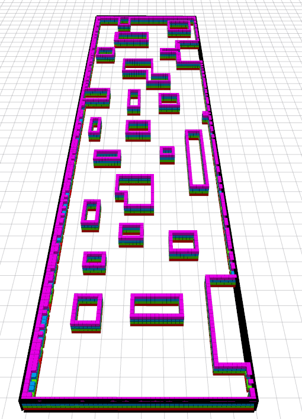

# MRSL Jump Point Search Planning Library
- - -
Jump Point Search for path planning in both 2D and 3D environments. Original jump point seach algorithm is proposed in ["D. Harabor and A. Grastien. Online Graph Pruning for Pathfinding on Grid Maps. In National Conference on Artificial Intelligence (AAAI), 2011"](https://www.aaai.org/ocs/index.php/AAAI/AAAI11/paper/download/3761/4007). The 3D version is proposed in ["S. Liu, M. Watterson, K. Mohta, K. Sun, S. Bhattacharya, C.J. Taylor and V. Kumar. Planning Dynamically Feasible Trajectories for Quadrotors using Safe Flight Corridors in 3-D Complex Environments. ICRA 2017"](http://ieeexplore.ieee.org/abstract/document/7839930/). 

## Installation 
#### Required: 
 - Eigen3
 - yaml-cpp

Simply run following commands to install dependancy:
```sh
$ sudo apt update
$ sudo apt install -y libeigen3-dev libyaml-cpp-dev cmake
```

#### A) Simple cmake
```sh
$ mkdir build && cd build && cmake .. && make -j4
```

#### B) Using CATKIN 
```sh
$ mv jps3d ~/catkin_ws/src
$ cd ~/catkin_ws & catkin_make_isolated -DCMAKE_BUILD_TYPE=Release
```

#### Include in other projects
Note that in other repository, add following commands in `CMakeLists.txt` in order to correctly link `jps3d`:
```sh
find_package(jps3d REQUIRED)
include_directories(${JPS3D_INCLUDE_DIRS})
...
add_executable(test_xxx src/test_xxx.cpp)
target_link_libraries(test_xxx ${JPS3D_LIBRARIES})
``` 

Two libs will be installed in the system: the standard `jps_lib` and a faster implementation `nx_jps_lib` written by Nikolay Anatasov. The latter one only supports 3D.

## Usage
The simple API are provided in the base planner class, here are some important functions to set up a planning thread:
```c++
std::unique_ptr<PlannerBase> planner(new XXXUtil(false)); // Declare a XXX planner
planner->setMapUtil(MAP_UTIL_PTR); // Set collision checking function
bool valid_jps = planner->plan(start, goal, 1, true); // Plan from start to goal with heuristic weight 1, using JPS
bool valid_astar = planner->plan(start, goal, 1, false); // Plan from start to goal with heuristic weight 1, using A*
```
Two XXX planners are provided:
 - ```GraphSearch2DUtil```
 - ```GraphSearch3DUtil```

## Example
An example in 2D map is given in `test/test_planner_2d.cpp`, in which we plan from start to goal using both ```A*``` and ```JPS```. 
The results are plotted in [corridor.png](https://github.com/sikang/jps3d/blob/master/data/corridor.png).
Green path is from ```A*```, red path is from ```JPS```.


```sh
$ ./build/test_planner_2d ../data/corridor.yaml
start: 2.5  -2   0
goal:  35 2.5   0
origin:  0 -5  0
dim: 799 199   1
resolution: 0.05
JPS Planner takes: 5.000000 ms
JPS Path Distance: 35.109545
AStar Planner takes: 66.000000 ms
AStar Path Distance: 35.109545
```

To generate map in `yaml` format which can be loaded directly in the test node, a simple executable file `test/create_map.cpp` is used. User can easily change the location of blocks in the source code.

## Doxygen
For more details, please refer to [Doxygen](https://sikang.github.io/jps3d).

